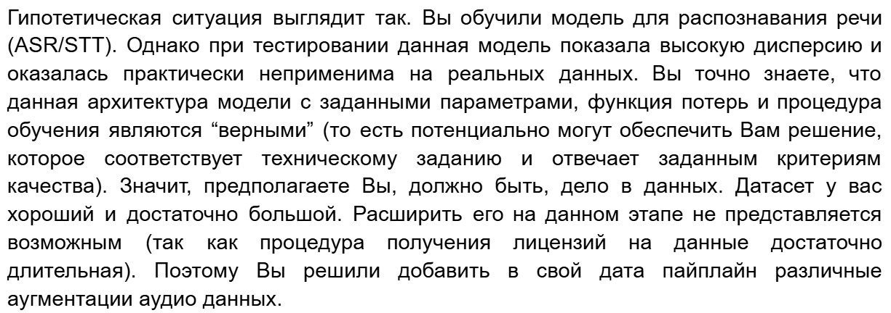

# Interesting_projects
Almost every day I solve applied problems, sometimes I come across very interesting ones, and I will post them here
___
## List of topics: 
1. Audio Data Augmentation + unit test 
___

### 1. Audio Data Augmentation + unit test 


Important stages:
1. Adding augmentation methods
```python
  # 1. Добавление шума
  noise_level = 0.05  # Уровень шума
  noise = np.random.randn(*audio_signal.shape) * noise_level
  audio_signal += noise
  # 2. Изменение скорости
  speed_factor = np.random.uniform(0.9, 1.1)  # Фактор изменения скорости
  audio_signal = librosa.effects.time_stretch(audio_signal.T, speed_factor).T
  # 3. Изменение тональности
  pitch_shift = np.random.randint(-3, 4)  # Сдвиг тональности
  audio_signal = librosa.effects.pitch_shift(audio_signal.T, sample_rate, n_steps=pitch_shift).T
  # 4. Добавление реверберации
  reverb_time = np.random.uniform(0.2, 0.5)  # Время реверберации
  audio_signal = librosa.effects.reverb(audio_signal.T, reverb_time).T
  # 5. Обрезка сигнала
  start_index = np.random.randint(0, int(audio_signal.shape[1] * 0.1))
  end_index = audio_signal.shape[1] - np.random.randint(0, int(audio_signal.shape[1] * 0.1))
  audio_signal = audio_signal[:, start_index:end_index]
```
1. Adding Tests
```python
    def test_noise_addition(self):
        """Проверяет добавление шума."""
        audio_signal = np.zeros((1, 100), dtype=np.float32)
        augmented_audio = audio_augmentation(audio_signal)
        self.assertTrue(np.any(augmented_audio != audio_signal))  # Проверяем, что сигнал изменился
    def test_speed_change(self):
        """Проверяет изменение скорости."""
        audio_signal = np.arange(100, dtype=np.float32).reshape(1, -1)
        augmented_audio = audio_augmentation(audio_signal)
        self.assertNotEqual(augmented_audio.shape[1], audio_signal.shape[1])  # Проверяем изменение длины
    def test_pitch_shift(self):
        """Проверяет сдвиг тональности."""
        audio_signal = np.array([1, 2, 3, 4, 5, 6, 7, 8, 9, 10], dtype=np.float32).reshape(1, -1)
        augmented_audio = audio_augmentation(audio_signal, sample_rate=44100)
        #  Невозможно точно проверить сдвиг тональности, но можно убедиться, что сигнал изменился
        self.assertTrue(np.any(augmented_audio != audio_signal))
    def test_reverb_addition(self):
        """Проверяет добавление реверберации."""
        audio_signal = np.zeros((1, 100), dtype=np.float32)
        augmented_audio = audio_augmentation(audio_signal)
        #  Невозможно точно проверить реверберацию, но можно убедиться, что сигнал изменился
        self.assertTrue(np.any(augmented_audio != audio_signal))
    def test_signal_cropping(self):
        """Проверяет обрезку сигнала."""
        audio_signal = np.arange(100, dtype=np.float32).reshape(1, -1)
        augmented_audio = audio_augmentation(audio_signal)
        self.assertLess(augmented_audio.shape[1], audio_signal.shape[1])  # Проверяем, что длина уменьшилась
    def test_multichannel_audio(self):
        """Проверяет работу с многоканальным аудио."""
        audio_signal = np.arange(200, dtype=np.float32).reshape(2, -1)  # 2 канала
        augmented_audio = audio_augmentation(audio_signal, num_channels=2)
        self.assertEqual(augmented_audio.shape[0], 2)  # Проверяем, что количество каналов сохранилось
```

[Decision](https://colab.research.google.com/drive/1DpMo9yHKTP3Z4jPABbtVIUe6zadzofVk?usp=sharing)
